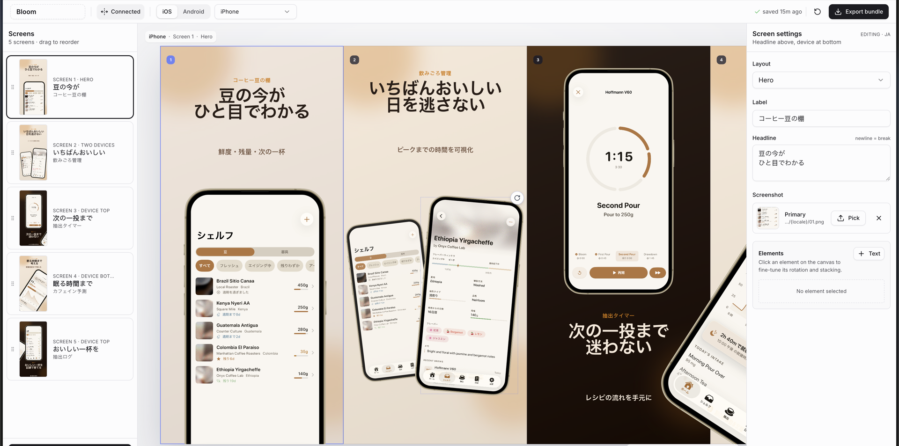

# App Store & Google Play Screenshots Generator

A skill for AI coding agents that scaffolds a production-ready Next.js editor for App Store and Google Play marketing screenshots. It gives you a connected canvas, real device frames, inspector controls, persistent project state, and one-click export bundles at store-ready sizes.



Example screenshots generated with this skill were accepted for [Bloom Coffee Shelf Recipe on the App Store](https://apps.apple.com/us/app/bloom-coffee-shelf-recipe/id6759914524).

## What It Does

- Builds a full screenshot editor instead of a static one-off page
- Turns raw app captures into ad-style slides with big readable copy
- Lets phones, captions, and decorative elements span adjacent screenshots on one connected canvas
- Keeps older projects safe with isolated-screen export mode until you opt into connected crops
- Saves every deck to `app-store-screenshots.json`, so the project is git-trackable and resumable
- Uploads picked screenshots into `public/screenshots/uploaded/<hash>.png`
- Supports iOS, iPad, Android phone, Android tablet, and Play Store feature graphic decks
- Exports exact PNG bundles for all required App Store and Google Play sizes
- Supports locales, RTL-aware copy/layout guidance, reusable themes, and in-place project migration

## Current Editor UI

- **Connected canvas** - view the whole screenshot strip at once, drag elements across screen boundaries, then export each screen as a precise crop.
- **Isolated mode** - preserve legacy decks where offscreen elements should not leak into neighboring exports.
- **Screen sidebar** - add, select, and drag-to-reorder screens with live thumbnails.
- **Inspector** - edit layout, labels, headlines, screenshots, element stacking, and transforms from the right panel.
- **Platform switcher** - keep iOS and Android decks side by side while sharing the same editor workflow.
- **Device selector** - design for iPhone, iPad, Android phone, Android tablets, and feature graphic formats.
- **Autosave** - writes to disk through `/api/project` and mirrors to `localStorage` for instant reloads.
- **Export bundle** - downloads a zip organized by platform, device, resolution, and locale.

Tip: when capturing source iPhone screenshots, the 6.1-inch simulator is usually the easiest starting point because it reduces manual image adjustment inside the frames.

## Install

### Using npx skills

```bash
npx skills add ParthJadhav/app-store-screenshots
```

Install globally:

```bash
npx skills add ParthJadhav/app-store-screenshots -g
```

Install for a specific agent:

```bash
npx skills add ParthJadhav/app-store-screenshots -a claude-code
```

This works with Claude Code, Cursor, Windsurf, OpenCode, Codex, and other agents supported by [`skills`](https://github.com/vercel-labs/skills).

### Manual install

```bash
git clone https://github.com/ParthJadhav/app-store-screenshots ~/.claude/skills/app-store-screenshots
```

## Usage

Once installed, ask your coding agent for store screenshots:

```text
Build App Store and Google Play screenshots for my app.
```

The skill guides the agent to ask for your app context, source screenshots, platforms, locales, visual direction, and slide count before generating the editor project.

## Example Prompts

```text
Build App Store screenshots for my habit tracker.
The app helps people stay consistent with simple daily routines.
I want 6 slides, clean minimal style, warm neutrals, and a calm premium feel.
```

```text
Generate App Store screenshots for my personal finance app.
The main strengths are fast expense capture, clear monthly trends, and shared budgets.
I want a sharp modern style with high contrast and 7 slides.
```

```text
Build App Store screenshots for my language learning app.
I need English, German, and Arabic screenshot sets.
Use two reusable themes: clean-light and dark-bold.
Make sure Arabic slides feel RTL-native, not just translated.
```

## Better Prompt Tips

- Say what the app does in one sentence
- List the top 3-5 features in priority order
- Mention the platforms and devices you need
- Describe the visual style you want
- Say how many slides you want
- Mention required locales or RTL languages
- Provide source screenshot paths, app icon, and style references when available

## What Gets Scaffolded

If starting from an empty folder, the skill creates a Next.js project like this:

```text
project/
├── public/
│   ├── mockup.png
│   ├── app-icon.png
│   └── screenshots/
│       ├── apple/
│       │   ├── iphone/{locale}/01.png
│       │   └── ipad/{locale}/01.png
│       └── android/
│           ├── phone/{locale}/01.png
│           ├── tablet-7/portrait/{locale}/01.png
│           ├── tablet-10/landscape/{locale}/01.png
│           └── feature-graphic/{locale}/01.png
├── app-store-screenshots.json
├── src/app/
│   ├── layout.tsx
│   └── page.tsx
├── src/components/editor/
│   ├── screenshot-editor.tsx
│   ├── toolbar.tsx
│   ├── sidebar.tsx
│   ├── inspector.tsx
│   ├── preview-stage.tsx
│   ├── slide-canvas.tsx
│   ├── screenshot-picker.tsx
│   └── device-frames.tsx
└── src/lib/
    ├── constants.ts
    ├── defaults.ts
    ├── storage.ts
    ├── image-cache.ts
    └── types.ts
```

The template README inside `skills/app-store-screenshots/template/README.md` documents the editor internals in more detail.

## Editor Workflow

1. Capture real app screenshots from a simulator, emulator, or device.
2. Ask your agent to scaffold or migrate the screenshot project.
3. Run the dev server and open the editor.
4. Use the sidebar to organize screens and the inspector to edit copy, layouts, screenshots, and elements.
5. Choose Connected or Isolated mode depending on whether elements should cross screen boundaries.
6. Click **Export bundle** to download store-ready PNGs.

Uploaded files are saved under `public/screenshots/uploaded/`, and the canonical deck state is saved in `app-store-screenshots.json`. Commit both to make the deck reproducible after a fresh clone.

## Export Sizes

### Apple App Store

| Display | Resolution |
|---------|------------|
| 6.9" | 1320 x 2868 |
| 6.5" | 1284 x 2778 |
| 6.3" | 1206 x 2622 |
| 6.1" | 1125 x 2436 |

### Google Play Store

| Device | Resolution |
|--------|------------|
| Phone portrait | 1080 x 1920 |
| 7" tablet portrait | 1200 x 1920 |
| 7" tablet landscape | 1920 x 1200 |
| 10" tablet portrait | 1600 x 2560 |
| 10" tablet landscape | 2560 x 1600 |
| Feature graphic | 1024 x 500 |

Screenshots are designed at the largest size for each platform and scaled down for smaller exports. Android frames are CSS-rendered, while iPhone uses the included `mockup.png` bezel.

## Project State

- `app-store-screenshots.json` is the source of truth for app name, active platform, active device, locales, theme, connected-canvas mode, slides, screenshot paths, and transforms.
- Runtime uploads are written to `public/screenshots/uploaded/<hash>.png`.
- The editor reads `localStorage` first for fast paint, then reconciles with the project file.
- Older project files are migrated to schema v2 on load while keeping legacy decks isolated unless connected mode was already enabled.
- Custom themes live in `src/lib/constants.ts`; unknown theme ids fall back to `clean-light`.

## Design Standards

- Screenshots are ads, not documentation
- Each slide should sell one clear user outcome
- Headlines should pass the one-second thumbnail test
- Adjacent slides should vary layout and device placement
- Cross-screen elements should never split required text or critical UI
- Exported crops must still work as standalone screenshots

## Tech Stack

| Dependency | Purpose |
|------------|---------|
| Next.js | Dev server and app shell |
| React | Editor UI |
| TypeScript | Project and slide state safety |
| Tailwind CSS | Styling |
| shadcn/ui + Radix | Controls, dialogs, selects, tooltips |
| html-to-image | Exact PNG rendering |
| JSZip | Bundle downloads |
| dnd-kit | Screen reordering |
| react-rnd | Draggable and resizable canvas elements |

## Requirements

- Node.js 18+
- One of bun, pnpm, yarn, or npm

## Contributing

Contributions are welcome, especially around export reliability, screenshot design guidance, migrations, and cross-agent compatibility. Start with `CONTRIBUTING.md`.

## License

MIT
